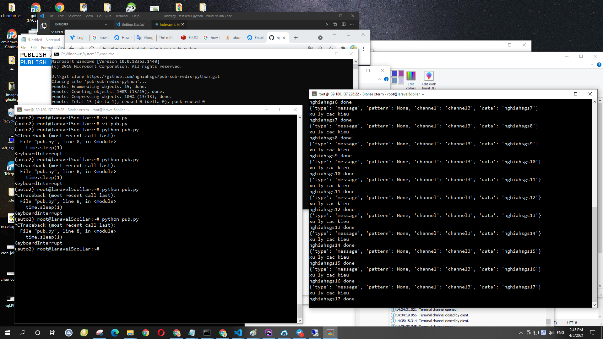

# pub-sub-redis-python
pub sub redis python

+ Dữ liệu chỉ được đổ ra tính tại thời điểm sub, các msg trước đó mà không subscribe sẽ bị missing (y như coi tv, không bạt lên lúc đó thì thôi nghỉ xem)
+ Trong trường hợp sub nhận được message, xử lý không kịp, job vẫn vào hàng chờ



Show tất cả các pubsub (những thằng đang lắng nghe)
```
PUBSUB CHANNELS
```
